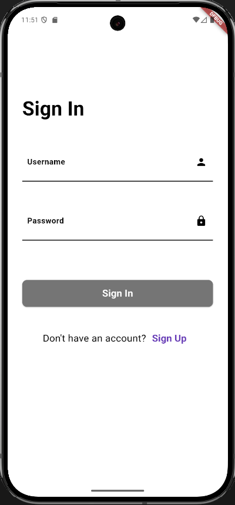

# Dioxide Mobile

Dioxide Mobile is a Flutter-based mobile application that provides stock analysis, investment advice, and general financial knowledge. It's designed to help users make informed decisions about their investments and stay up-to-date with the latest market trends.

## Features

*   **Stock Analysis:** Get detailed analysis of specific stocks, including historical price data and key metrics.
*   **Investment Advice:** Receive personalized investment advice based on your risk tolerance and financial goals.
*   **General Knowledge:** Access a wealth of information on financial topics, from basic concepts to advanced strategies.
*   **User Authentication:** Securely sign up and log in to your account to access personalized features.
*   **Profile Management:** Update your name and username to keep your profile up-to-date.

## Previews

<table>
  <tr>
    <td align="center"><br><sub><b>Logo Page</b></sub></td>
    <td align="center"><br><sub><b>Sign In Page</b></sub></td>
    <td align="center"><br><sub><b>Sign Up Page</b></sub></td>
  </tr>
  <tr>
    <td align="center"><br><sub><b>Home Page</b></sub></td>
    <td align="center"><br><sub><b>Search Page - Investment Advices</b></sub></td>
    <td align="center"><br><sub><b>Search Page - Knowledge Based Output</b></sub></td>
  </tr>
  <tr>
    <td align="center"><br><sub><b>Search Page - Specific Stock Analysis</b></sub></td>
    <td align="center"><br><sub><b>Graph Page</b></sub></td>
    <td align="center"><br><sub><b>Graph Page - Single Type Data</b></sub></td>
  </tr>
</table>
<table align="center">
  <tr>
    <td align="center"><br><sub><b>Notification Page</b></sub></td>
    <td align="center"><br><sub><b>Profile Page</b></sub></td>
  </tr>
</table>

## Getting Started

To get a local copy up and running, follow these simple steps.

### Prerequisites

*   Flutter SDK: [https://flutter.dev/docs/get-started/install](https://flutter.dev/docs/get-started/install)
*   Android Studio or VS Code

### Installation

1.  Clone the repo
    ```sh
    git clone https://github.com/your_username_/your_project_name.git
    ```
2.  Install packages
    ```sh
    flutter pub get
    ```
3.  Run the app
    ```sh
    flutter run
    ```

## Dependencies

*   [flutter](https://flutter.dev/)
*   [fl_chart](https://pub.dev/packages/fl_chart)
*   [http](https://pub.dev/packages/http)
*   [android_intent_plus](https://pub.dev/packages/android_intent_plus)
*   [intl](https://pub.dev/packages/intl)
*   [cupertino_icons](https://pub.dev/packages/cupertino_icons)

## Contributing

Contributions are what make the open source community such an amazing place to learn, inspire, and create. Any contributions you make are **greatly appreciated**.

If you have a suggestion that would make this better, please fork the repo and create a pull request. You can also simply open an issue with the tag "enhancement".
Don't forget to give the project a star! Thanks again!

1.  Fork the Project
2.  Create your Feature Branch (`git checkout -b feature/AmazingFeature`)
3.  Commit your Changes (`git commit -m 'Add some AmazingFeature'`)
4.  Push to the Branch (`git push origin feature/AmazingFeature`)
5.  Open a Pull Request

## License

Distributed under the MIT License. See `LICENSE` for more information.
